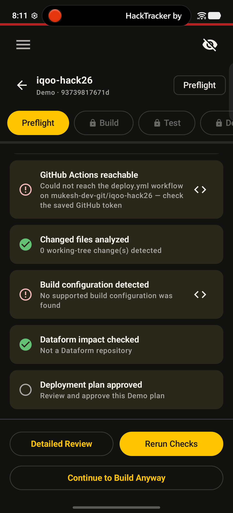
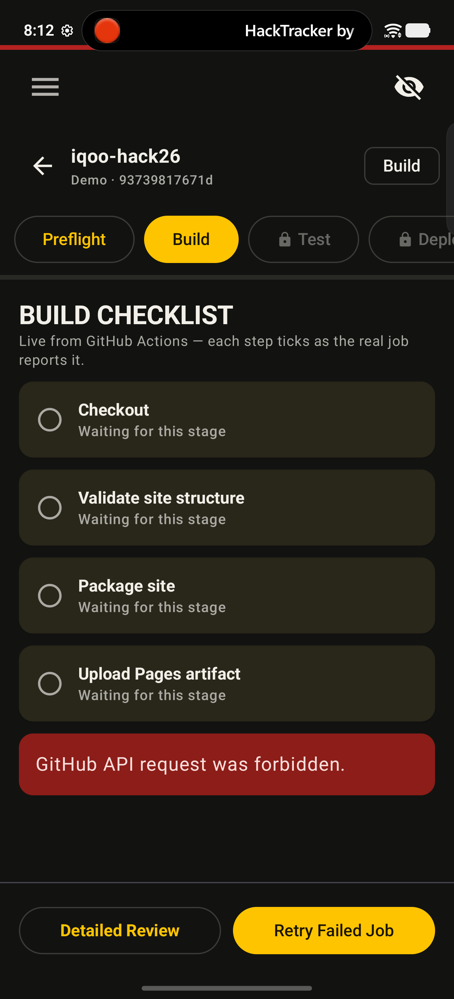
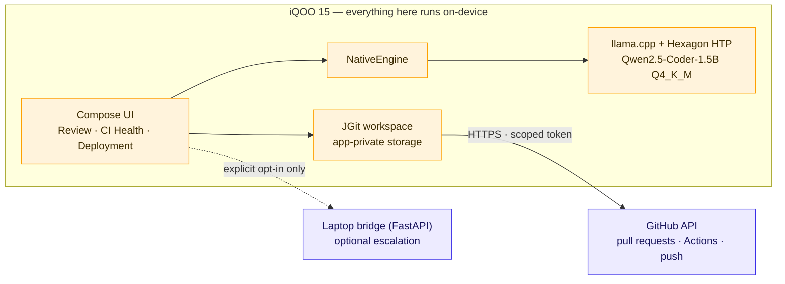

<div align="center">


### Review, fix and ship real code from your phone.
**The model runs on the phone's NPU — so your code never leaves the device.**

<br>


**Team Limitless** · iQOO Hackathon 2026 — Chennai City Battle · Developer Tools

</div>

---

## Why this exists

Every developer tool that runs on a phone is **read-only**. GitHub's app, CI dashboards, alerting tools — they can all show you that a pull request needs review or that a build has broken. None of them can do anything about it. The moment the work requires *changing* code, every one of them hands the problem back and waits for you to reach a laptop.

Time-to-recovery for a broken build is almost never limited by how hard the bug is. It's limited by how long it takes a human to get to a keyboard.

The obvious fix — a cloud AI assistant — trades that for a worse problem: your unreleased code has to leave the device to be read by a GPU you don't own. Security teams refuse it, it needs a network you may not have, and it bills per token.

|  | Notice it | Understand it | Change it | Ship it |
|---|:---:|:---:|:---:|:---:|
| **GitHub mobile** | ✅ | ⭕ | ⭕ | ⭕ |
| **Cloud AI reviewer** | ✅ | ✅ | ◐ | ⭕ |
| **iQForge** | ✅ | ✅ | ✅ | ✅ |

---

## What it does

### 🔍 Pull request review — end to end

The on-device model explains in plain English what a PR actually *does* — intent first, not a raw diff — then reviews each changed file and returns findings ranked **blocker** or **warning**, alongside readiness checks like merge conflicts. If something's wrong, open it in a code session, have the model write the fix, commit and push from the phone. Then approve and **merge at the exact commit SHA you reviewed**, so nothing drifts between review and merge.

### 🚀 Deployment — end to end

A preflight checklist resolves live evidence — commit SHA, GitHub Actions reachability, changed files, build configuration — and **each check earns its tick only when evidence confirms it**, never because time passed. After an explicit approval on the device, iQForge dispatches a **real GitHub Actions workflow** and polls the actual run, ticking each job and step as GitHub reports it. On failure it pulls the real error lines out of the job log and hands them to the on-device model. Fix, push, re-run only the failed jobs on the same commit, then verify the deployed site responds.

### 🩺 Self-healing CI diagnosis

A failed job isn't one error — it's one real break followed by dozens of knock-on errors. Scroll a 4,000-line log on a phone and you always land at the bottom, on a symptom. Give iQForge the log and it classifies the failure as **flaky or a real regression**, names the responsible file and line, and explains why. Then it attempts the fix, commits, pushes and re-triggers the pipeline.

<div align="center">
<table>
<tr>
<td width="50%"></td>
<td width="50%"></td>
</tr>
<tr>
<td align="center"><sub><b>Preflight</b> — every tick backed by real evidence</sub></td>
<td align="center"><sub><b>Build</b> — live GitHub Actions steps, real errors surfaced</sub></td>
</tr>
</table>
</div>

---

## How it works



Inference is served locally by `llama.cpp` with HTP offload onto the Snapdragon Hexagon NPU, launched and supervised through **Shizuku** (shell-UID access, granted once by the user). The only network egress is GitHub's own API — the same endpoint you already trust.

### Engineering for the thermal envelope

Running sustained inference on a phone is not the same as running it on a laptop, and most of the tuning here came from measuring that:

- **CPU threads are capped during prompt ingestion** (`-t 4 --threads-batch 4`) so the Prime cores don't thermally throttle while the NPU does tensor math
- **Patches are budgeted** — top 5 changed files, 2,500 chars per patch, 6,000 char total
- **Review passes are spaced** with a 200 ms cooldown between files
- **Cold HTP model load takes up to 30 s** — the health poll window is sized for it, because a short timeout triggers a retry that kills the in-progress load and restarts the clock

### Device-native touches

Monster Halo RGB thinking indicator (driven through vivo's light service), tilt-to-scroll and shake-to-regenerate gestures, and a face-down session lock for shoulder-surf protection — which stays locked until an explicit tap, because whatever was on screen may already have been seen.

---

## Security & privacy

This is the part that makes write access acceptable in a real organisation:

- **Inference is on-device.** Diffs, source and build logs are never sent to an inference server.
- **Repositories live in the Android app sandbox**, private to the app.
- **`allowBackup=false`** — app data can't be extracted via adb backup.
- **The GitHub token is fine-grained and scoped**, entered once and never displayed again.
- **Nothing reaches production without an explicit tap** on the device.

---

## Getting started

**1. Read [`CONTRACT.md`](CONTRACT.md) first.** It's short, and it's the interface contract that lets several people build in parallel.

**2. The phone app** — open `mobile/` in Android Studio. Java 17, compile/target SDK 34, min SDK 26.

```bash
cd mobile && ./gradlew assembleDebug
```

**3. The NPU daemon** — the app can start it itself via Shizuku, or launch it from a paired machine:

```powershell
./scripts/start_npu_server.ps1
```

**4. The laptop bridge** (optional — only needed for escalation and toolchain execution):

```bash
cd bridge && pip install -r requirements.txt
uvicorn server:app --host 0.0.0.0 --port 8000
```

**5. In the app**, open Settings → GitHub access and save a fine-grained token with **Contents: read/write**, **Pull requests: read/write**, and **Actions: write** (that last one is required to dispatch workflows from the Deployment page).

---

## Repo layout

```
iqforge/
├── mobile/      the phone app — Android Studio project (Kotlin, Compose)
│   └── app/src/main/java/com/iqforge/
│       ├── MainActivity.kt     UI, agent, review + CI Health pages
│       ├── deployment/         Deployment page and view model
│       ├── github/             GitHub API client, PR review models
│       ├── engine/             NPU daemon control, native inference
│       ├── hardware/           Monster Halo light manager
│       └── sensors/            tilt, shake, face-down gestures
├── bridge/      laptop-side FastAPI server — escalation + toolchain exec
├── scripts/     NPU daemon launcher
├── examples/    sample project used for on-device edit demos
├── Document/    build plan, NPU setup notes, submission docs
└── CONTRACT.md  the phone ↔ bridge JSON contract
```

---

## Roadmap

A **repository context index** the on-device model can query for definitions and call sites — giving it cross-file awareness while all reasoning stays local. Because only lookups leave the model, that index can be hosted inside a customer's own network, which is something a cloud-inference tool can never offer.

---

<div align="center">
<sub>Built by <b>Team Limitless</b> — Mukesh, Delfi, Nambert Jones · iQOO Hackathon 2026</sub>
</div>
